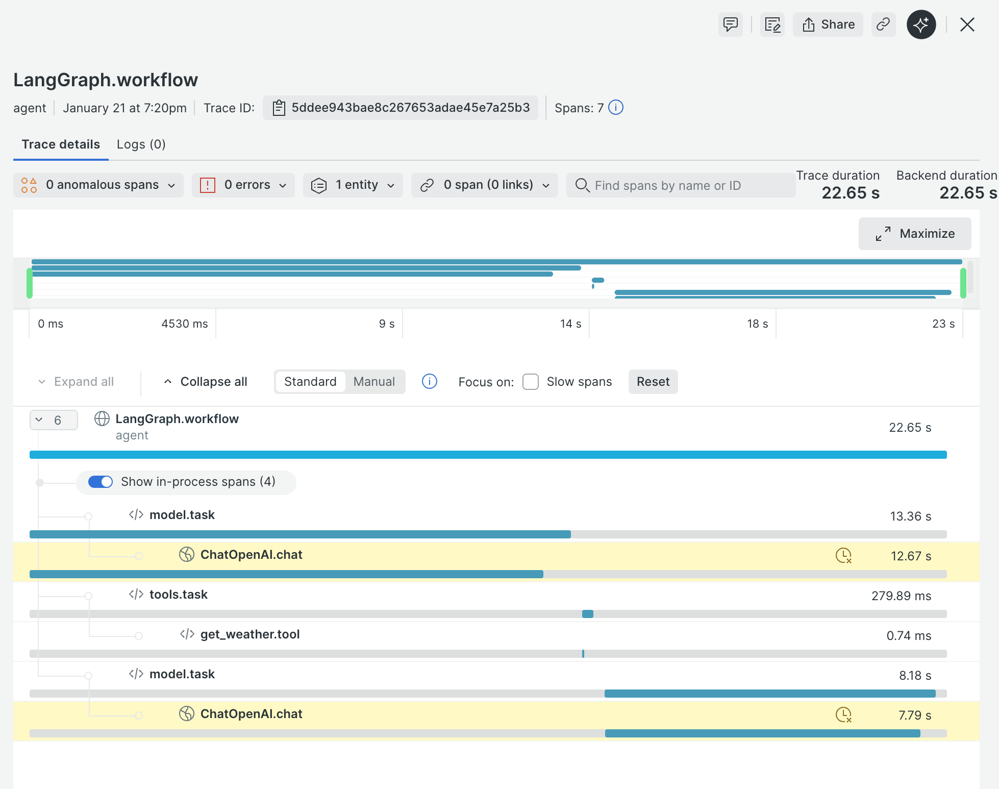

## Overview
Simple LangChain + Traceloop demos for learning and experimentation, now oriented around running the notebooks in VS Code.

## Getting Started
1) Install Python 3.12+.  
2) Install dependencies: `uv sync`  
3) Set env vars in `.env`:  
   - `OPENAI_MODEL` (e.g., `ollama:qwen2.5:3b`)  
   - Optional: `TRACELOOP_API_KEY` if you enable telemetry
4) Jupyter kernels: you already added `ipykernel`—select the `uv` environment kernel in VS Code.

